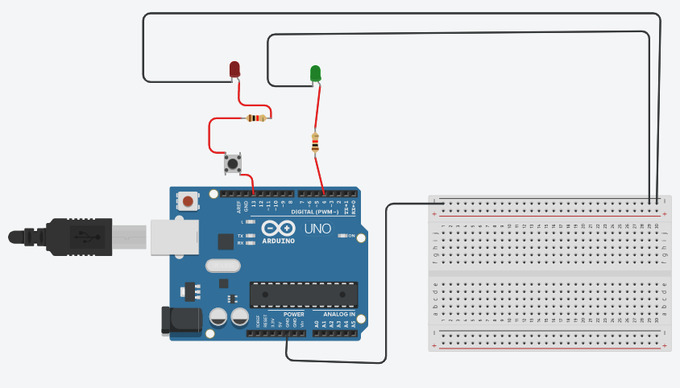
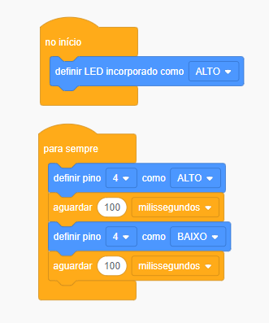
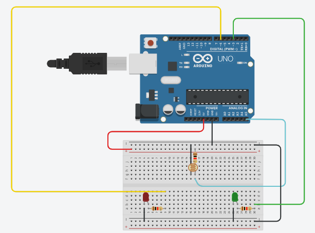
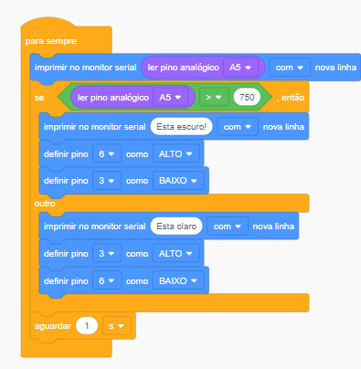
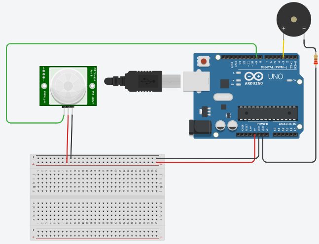
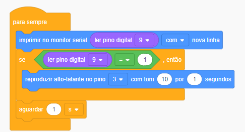

# Curso-de-Extens-o---IoT---USJT
Curso de Extensão USJT - IoT na prática para iniciantes

-----------------------------------------------------------------------------------------------------------------------------------------------------------------------
  Aula 03/09/2022 - Projeto de Fotoresistor e Sensor de Moviemento com Buzzer - Por Prof. Henrique Poyatos:
-----------------------------------------------------------------------------------------------------------------------------------------------------------------------

Construímos nosso primeiro projeto em arduino. Uma introdução mostrando como funciona alguns componentes e como montamos os códigos para rodar determinadas funções. Criamos um pisca pisca simples, com 2 LEDs, e incorporamos a função de botão em um deles.

<a href="piscapisca.ino">Clique aqui para o código.<a/>

-----------------------------------------------------------------------------------------------------------------------------------------------------------------------
VERSÃO EM BLOCOS
-----------------------------------------------------------------------------------------------------------------------------------------------------------------------

-----------------------------------------------------------------------------------------------------------------------------------------------------------------------
  
-----------------------------------------------------------------------------------------------------------------------------------------------------------------------
  Aula 10/09/2022 - Projeto de Fotoresistor e Sensor de Moviemento com Buzzer - Por Prof. Henrique Poyatos:
-----------------------------------------------------------------------------------------------------------------------------------------------------------------------
*FOTORESISTOR*
  
Partimos para um projeto um pouco mais complexo, um sensor de luminosidade, que demandou um código mais elaborado e um novo componente: O fotoresistor. Fizemos as informações sobre a luminisidade serem transmitidas pelo monitor serial.

 

<a href="projeto fotoresistor.ino">Clique aqui para o código.<a/>  
  
-----------------------------------------------------------------------------------------------------------------------------------------------------------------------
VERSÃO EM BLOCOS
-----------------------------------------------------------------------------------------------------------------------------------------------------------------------

-----------------------------------------------------------------------------------------------------------------------------------------------------------------------
*SENSOR DE MOVIMENTO COM BUZZER*

Na segunda metade da aulas construímos um exemplo de Sensor de Movimento, que ao detectar um movimento dispara um som que é emitido pelo Piezo incorporado a placa.

 

<a href="sensor de mov.ino">Clique aqui para o código.<a/> 

-----------------------------------------------------------------------------------------------------------------------------------------------------------------------
VERSÃO EM BLOCOS
-----------------------------------------------------------------------------------------------------------------------------------------------------------------------

-----------------------------------------------------------------------------------------------------------------------------------------------------------------------

-----------------------------------------------------------------------------------------------------------------------------------------------------------------------
MICROBIT - Aula Inaugural - Por Prof. Henrique Poyatos:
-----------------------------------------------------------------------------------------------------------------------------------------------------------------------
-----------------------------------------------------------------------------------------------------------------------------------------------------------------------
Tivemos uma introdução ao curso e as placas que poderíamos usar, sendo uma delas o Microbit. Desenvolvemos um sensor de luminosidade também, contudo, exploramos mais os recursos sonoros.
-----------------------------------------------------------------------------------------------------------------------------------------------------------------------
  
*Escapando um pouco do que foi mostrado em aula, montei um código para rodar o Tema de "JoJo´s Bizarre Adventure Parte 5 - Golden Wind", tema esse entitulado "il vento d’oro". Montei esse código graças à um vídeo no youbute, já que não havia nenhum repositóro que disponibilizava o código para importar direto para o microbit.* 

*Não cheguei a terminar o código mas decidi postá-lo aqui, pois quem sabe eu não termino ele por completo ou resolvo usá-lo para algum outro projeto.*

*ESTE CÓDIGO FOI CRIADO APENAS PARA FINS RECREATIVOS, EM TOM DE BRINCADEIRA.*
